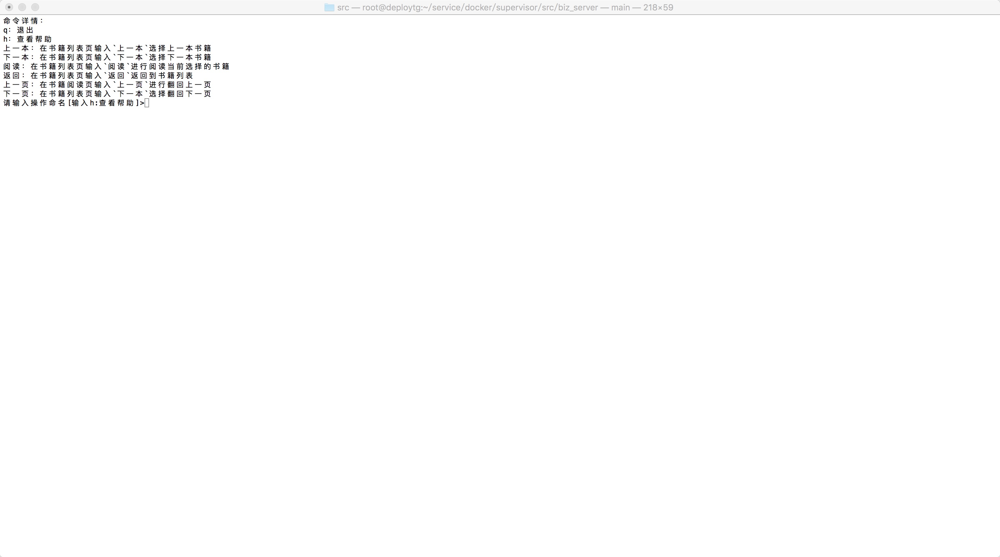

## 终端阅读器

### 命名详情

|命令|描述|
|:----|:----|
|阅读|在书籍列表页输入`阅读`进行阅读当前选择的书籍|
|返回|在书籍列表页输入`返回`返回到书籍列表|
|上一本|在书籍列表页输入`上一本`选择上一本书籍|
|下一本|在书籍列表页输入`下一本`选择下一本书籍|
|上一页|在书籍阅读页输入`上一页`进行翻回上一页|
|下一页|在书籍列表页输入`下一本`选择翻回下一页|
|h|查看帮助|
|q|退出|

 

 

 

 
